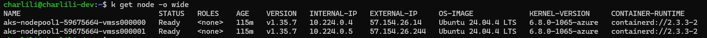
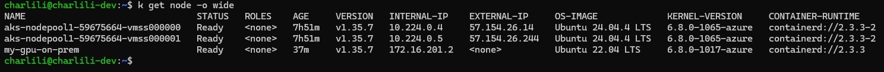
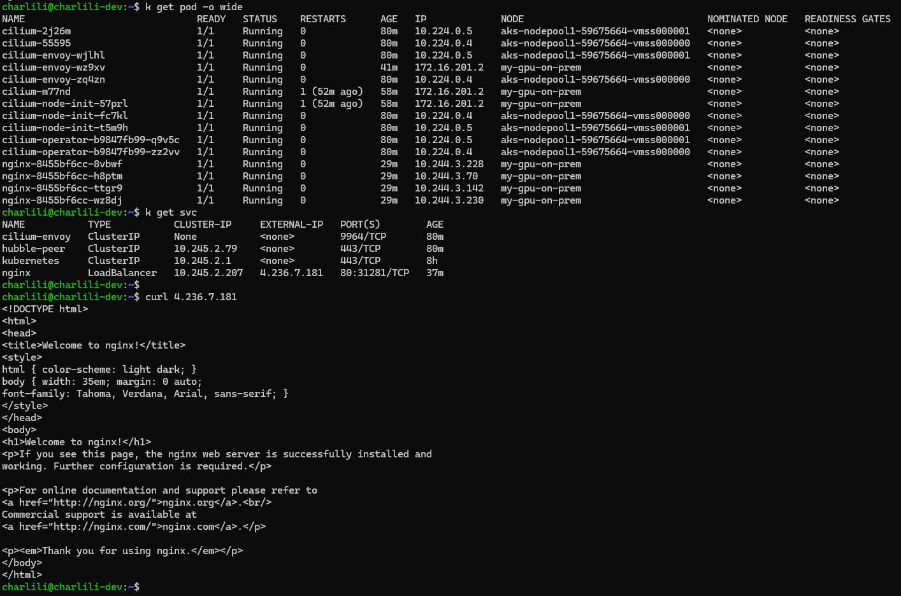

# aks-managed-onprem GPU machines

Scripts to join an on-premises (or otherwise external) GPU machine as a worker
node in an AKS-managed Kubernetes cluster, connected back to Azure over a
point-to-site (P2S) VPN.

The high-level idea:

1. Create an AKS cluster in Azure with a VNet + point-to-site VPN gateway
   (`cloud/`).
2. Generate client certificates and a matching OpenVPN client configuration so
   an on-prem machine can join that VNet (`onprem/generate-certificates.sh`,
   `cloud/upload-certificate-and-download-vpn-config.sh`).
3. Connect the on-prem machine to the VNet over OpenVPN (`onprem/vpn.sh`).
4. Optionally onboard the on-prem machine to Azure Arc for identity
   (`cloud/generate-arc-join.sh`), then generate and run a bootstrap script
   that installs `containerd`/`runc`/`kubelet` on the on-prem machine and
   joins it to the AKS control plane as a node
   (`cloud/generate-node-bootstrap-file.sh`), granting it the right
   permissions to act as a node (`cloud/assign-permissions-to-act-as-node.sh`).
5. Install Cilium (in BYOCNI mode) so pod networking works across both the
   AKS-managed nodes and the on-prem node.

## Prerequisites

- [Azure CLI](https://learn.microsoft.com/cli/azure/install-azure-cli) (`az`),
  logged in with `az login` (see notes on Conditional Access below if your
  account is blocked from signing in on an unmanaged/unenrolled machine).
- `kubectl` and [`helm`](https://helm.sh/).
- `jq` (used by several scripts to parse Azure CLI JSON output).
- An Azure subscription with permission to create resource groups, VNets, a
  VPN gateway, and an AKS cluster.
- On the on-prem machine: Ubuntu (22.04/24.04 tested), with `sudo` access.

## 1. Configure environment variables

Everything is driven by shell variables set in
[`cloud/environment-setup.sh`](cloud/environment-setup.sh). Edit the values
there (region, CIDRs, etc.) as needed, then source it in every shell you use
to run the scripts below:

```bash
source cloud/environment-setup.sh
```

This exports (among others): `SUBSCRIPTION`, `RESOURCE_GROUP`,
`CLUSTER_NAME`, `REGION`, `VNET_ID`, `SUBNET_ID`, `POD_CIDR`, and the various
CIDR ranges used for the VNet, node subnet, cluster service CIDR, and gateway
subnet. Make sure these don't overlap with your on-prem network.

## 2. Create the Azure resources

```bash
bash cloud/resource-creation.sh [-a <acr-name>]
```

This creates, in order:

- The resource group.
- A VNet + node subnet.
- A `GatewaySubnet` and a public IP for the point-to-site VPN gateway.
- A VPN gateway (`VpnGw2AZ`, OpenVPN, route-based) — **this step alone takes
  roughly 25 minutes**.
- The AKS cluster itself, with `--network-plugin none` (BYOCNI) so Cilium can
  be installed afterwards, `--enable-node-public-ip`, and AAD + Azure RBAC
  enabled.
- An empty user node pool (`nodepool2`, 0 nodes) for cloud-side workloads.
- AKS credentials (`az aks get-credentials`).
- Cilium, installed via Helm in `aksbyocni` mode with `nodeinit.enabled=true`
  and the pod CIDR configured to match `$POD_CIDR`.

Pass `-a <acr-name>` if you want the cluster to have pull access to an Azure
Container Registry.

At this point, `kubectl get nodes` should show only the AKS-managed VM nodes:



## 3. Generate client certificates for the VPN

On the on-prem machine (or wherever you'll connect from):

```bash
bash onprem/generate-certificates.sh
```

This creates a self-signed CA and a client certificate/key pair
(`<hostname>Cert.pem`, `<hostname>Key.pem`) and prints the base64-encoded CA
certificate, which you'll need in the next step.

## 4. Upload the certificate and fetch the VPN client config

Back where you have `az` access to the subscription (with the environment
variables from step 1 sourced):

```bash
source cloud/environment-setup.sh
bash cloud/upload-certificate-and-download-vpn-config.sh \
  -n <cert-name> \
  -c "<base64 CA cert data from step 3>"
```

This uploads the root certificate to the VPN gateway and downloads
`vpnconfig.ovpn`, the OpenVPN client configuration to use for connecting.

## 5. Connect the on-prem machine over VPN

Copy `vpnconfig.ovpn`, along with the `<hostname>Cert.pem` and
`<hostname>Key.pem` files generated in step 3, to the on-prem machine (same
directory as `onprem/vpn.sh`), then run:

```bash
bash onprem/vpn.sh
```

This embeds the client certificate/key into the `.ovpn` file, installs
`openvpn` and `network-manager-openvpn`, and configures OpenVPN to
autostart the `vpnconfig` profile via systemd.

> If `apt-get` fails to fetch a package (e.g. a 404 on a dependency like
> `wireless-regdb`), your local apt package index is likely stale — the
> script runs `apt-get update` first specifically to avoid this.

## 6. Bootstrap and join the on-prem node

### Onboard the on-prem GPU machine to Azure Arc (optional)

If you're using the `arc` or `arccsr` auth type (see below), the on-prem
machine first needs to be onboarded to Azure Arc so it has an ARM resource
ID and managed identity. From a machine with `az` access to the
subscription, generate and run the onboarding script:

```bash
source cloud/environment-setup.sh
bash cloud/generate-arc-join.sh
```

This produces `arc-join.sh`. Copy it to the on-prem machine and run it there
to install and connect the Azure Arc agent (`azcmagent`).

### Generate and run the node bootstrap script

From a machine with `az`/`kubectl` access to the cluster:

```bash
bash cloud/generate-node-bootstrap-file.sh \
  -i <ARM resource ID of the AKS cluster> \
  -a <arc|arccsr|bootstrap> \
  -e <name of an existing node to copy /etc/kubernetes/azure.json from>
```

This generates a `bootstrap-<cluster>--<resource-group>--<auth-type>.sh`
script that installs a matching `containerd`/`runc`/`kubelet` and configures
the systemd units needed to join the node. Copy that generated script to the
on-prem machine and run it there.

Depending on the auth type chosen, you may also need to grant the node
permission to act as a Kubernetes node:

```bash
bash cloud/assign-permissions-to-act-as-node.sh \
  -i <ARM resource ID of the AKS cluster> \
  -m <ARM resource ID of the Arc machine/VM> \
  -a <arc|arccsr|azure|azurecsr>
```

### Keeping the node's internal IP in sync

Because the on-prem node's VPN-assigned IP (on `tun0`) can change across
reconnects/reboots, run `cloud/update-node-ip.sh` on the node to keep
kubelet's advertised `--node-ip` in sync with the current tunnel address:

```bash
sudo bash cloud/update-node-ip.sh [-v <network interface>]  # default: tun0
```

Consider running this periodically (e.g. via cron or a systemd timer) if the
VPN-assigned address isn't stable.

## Verifying the setup

```bash
kubectl get nodes -o wide
kubectl get pods -n default -l k8s-app=cilium -o wide
kubectl get pods -n default -o wide | grep cilium-envoy
```

All nodes (AKS-managed and on-prem) should show `Ready`, and Cilium/Cilium
Envoy pods should be `Running` on every node. The on-prem GPU node should now
appear alongside the AKS-managed VM nodes:



## Deploy a sample workload on the on-prem node

To confirm the on-prem node can actually run workloads and receive traffic
from the cluster's Service networking, deploy a sample Nginx pod pinned to it
with `nodeSelector`, and expose it via a `LoadBalancer` Service:

Wait for the Service to get an external IP, then verify:

```bash
kubectl get svc nginx --watch   # Ctrl-C once EXTERNAL-IP is assigned
curl http://<EXTERNAL-IP>
```

You should see the default Nginx welcome page.



> **Why this works even though the on-prem node isn't in the Azure Load
> Balancer's backend pool:** the Azure cloud provider only adds actual Azure
> compute resources (the AKS VMSS nodes) to the LB's backend pool — the
> manually-joined on-prem node has no corresponding Azure NIC/VM, so it can
> never be an LB backend itself. Instead, traffic lands on one of the AKS
> nodes' `NodePort`s and is then forwarded across the pod network (via
> Cilium, over the VPN tunnel) to wherever the pod actually runs — in this
> case, the on-prem node. This is standard Kubernetes Service routing
> behavior and requires no extra configuration, but it does mean the on-prem
> node can only ever be a traffic *destination*, never a direct LB target.

Clean up when done:

```bash
kubectl delete deployment nginx-onprem
kubectl delete service nginx-onprem
```

## Running real AI inference/fine-tuning workloads

The Nginx example above just proves out connectivity and Service routing to
the on-prem node. If you want to run real AI inference/fine-tuning workloads
on the on-prem GPU nodes, you can deploy the KubeRay operator using the guide
in [chengliangli0918/aks-ray](https://github.com/chengliangli0918/aks-ray).

## License

[MIT](LICENSE)
